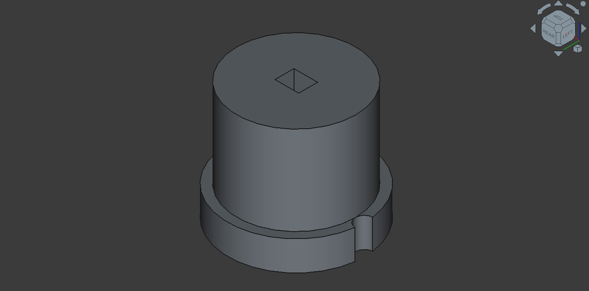
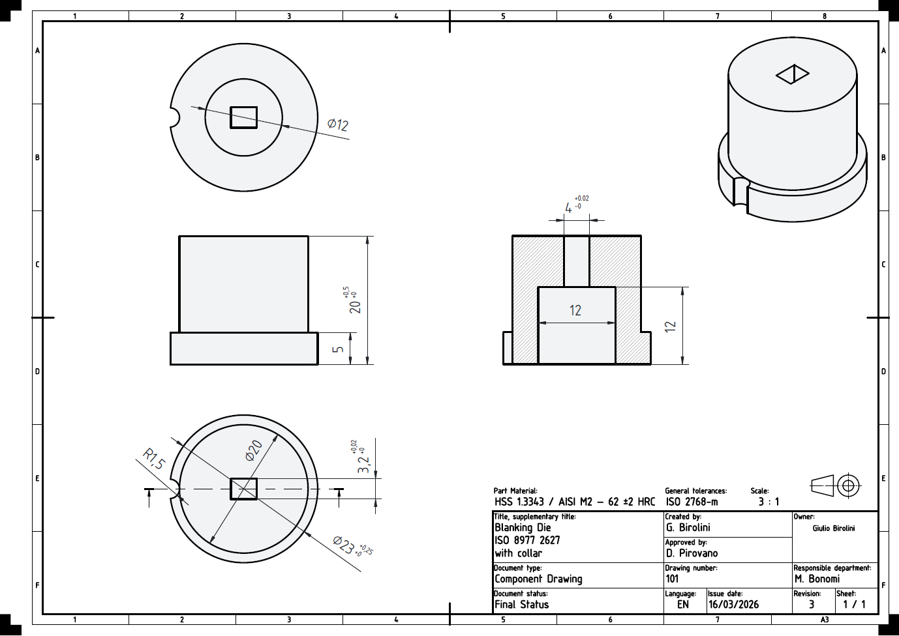

# Orobic Precision Parts — Manufacturing KPI Dashboard

**Fictional company notice:** Orobic Precision Parts S.r.l. is a fictional small manufacturing company created for portfolio and educational purposes. All production data is synthetic, generated with Python using statistically realistic distributions calibrated on real-world OEE benchmarks for job-shop machining. The part geometry, process, and specifications are technically accurate and based on ISO 8977 standard references.

---

## Purpose and Scope

This project demonstrates how a small precision machining company can monitor and analyse its manufacturing KPIs using open-source tools, without enterprise-grade infrastructure. The stack combines Python for data engineering and analysis with Power BI for interactive dashboards.

The project is designed to showcase a complete skill set across multiple disciplines:

| Layer | Skill demonstrated |
|---|---|
| Part design | Engineering judgement — selecting a part that technically justifies every process step |
| CAD | FreeCAD — 3D solid modelling and 2D orthographic drawing with title block |
| Data engineering | Python ETL pipeline — raw to validated to aggregated KPI tables |
| Data analysis | OEE decomposition, Pareto, scrap trend, machine benchmarking |
| Visualisation | matplotlib / seaborn — publication-quality charts |
| BI dashboard | Power BI — DAX measures, time-based calculations, drill-through |
| Documentation | Technical README with process rationale and engineering context |

---

## The Company — Orobic Precision Parts S.r.l.

Fictional company, created for portfolio purposes only.

| | |
|---|---|
| **Founded** | 1989 |
| **Location** | Bergamo area, Lombardy, Italy |
| **Size** | ~20 employees, family-owned (2nd generation) |
| **Certification** | ISO 9001:2015 |
| **Specialisation** | Low-to-medium volume precision steel components for industrial OEM |
| **Clients** | Automation, packaging machinery, agricultural equipment, general engineering |

Orobic Precision Parts was established as a small tool shop by the Birolini family in the Bergamo foothills, an area historically dense with precision machining SMEs. Now in its second generation, the company has grown to approximately 20 people while preserving the hands-on culture and direct client relationships that define a family business. Every order is managed through a complete in-house process chain, from raw bar stock to final CMM inspection.

The name Orobic refers to the Orobie Alps, the mountain range that defines the landscape north of Bergamo.

---

## Reference Part — Blanking Die with Collar (ISO 8977 / FIBRO 2627)

### Why this part was chosen

The part selection was deliberate and technically grounded. A Blanking Die with collar, square profile (ISO 8977) was chosen because it justifies every operation in the process chain without forcing any step. This is the kind of engineering judgement that separates a well-designed case study from a generic template.

| Step | Why it is needed for this part |
|---|---|
| Band Saw | Blank cut from flat tool steel bar stock |
| CNC Lathe | Collar OD (Ø23), body OD (Ø20), and blind pocket Ø12 turned before hardening |
| CNC Milling | Top and bottom faces, relief features |
| **EDM Wire-Cut** | Square 4×3.2mm cutting profile with sharp 90° corners — mandatory after hardening to 62 HRC. No other process can produce sharp internal corners on hardened HSS |
| Surface Grinder | Mating faces ground to Ra 0.4 µm, flatness 0.01 mm |
| CMM Inspection | Full dimensional report — tight profile tolerance +0.02/0 mm |

The EDM step is the key design decision. The square internal profile cannot be milled (minimum fillet radius equals tool radius) and the material at 62 HRC cannot be conventionally machined after hardening. Wire EDM is the only viable process. This is standard industrial practice for blanking dies and stamping tooling.

### Technical Drawings

The 2D and 3D drawings below were produced in FreeCAD (open-source CAD) as part of this project, demonstrating the ability to translate a manufacturing concept into a complete technical document.

| | |
|---|---|
|  |  |
| Isometric 3D view — FreeCAD Part Design | Orthographic drawing with section A-A — FreeCAD TechDraw |

### Part Specifications

| Parameter | Value |
|---|---|
| **Standard** | ISO 8977 / FIBRO 2627 |
| **Square cutting profile** | 4×3.2 mm (+0.02/0) — wire EDM |
| **Blind pocket** | Ø12 mm, depth 12 mm — punch slug clearance |
| **Body diameter** | Ø20 mm |
| **Collar diameter** | Ø23 mm (+0.25/0) |
| **Body height** | 20 mm (+0.5/0) |
| **Collar height** | 5 mm |
| **Corner radius** | R1.5 mm |
| **Material** | HSS 1.3343 / AISI M2 — 62 ±2 HRC |
| **Surface finish (ground faces)** | Ra 0.4 µm |
| **Flatness** | 0.01 mm |
| **General tolerances** | ISO 2768-m |

### CAD Files

| File | Format | Description |
|---|---|---|
| `Blanking_Die_ISO_8977_2627_with_collar.FCStd` | FreeCAD native | 3D model and 2D drawing |
| `Blanking_Die_ISO8977_2627.step` | STEP | 3D universal CAD exchange format |
| `Blanking_Die_ISO8977_2627_Drawing.pdf` | PDF | 2D technical drawing for print |
| `Blanking_Die_ISO8977_2627_Drawing.svg` | SVG | 2D technical drawing vector |

---

## Production Process

```
┌──────────┐    ┌──────────┐    ┌──────────┐    ┌──────────┐    ┌──────────┐    ┌──────────┐
│ Band Saw │───▶│CNC Lathe │───▶│CNC Mill  │───▶│EDM Wire- │───▶│ Surface  │───▶│   CMM    │
│   #1     │    │   #1     │    │   #1     │    │  Cut #1  │    │Grinder#1 │    │Inspect.#1│
└──────────┘    └──────────┘    └──────────┘    └──────────┘    └──────────┘    └──────────┘
  Bar stock      Collar, OD,    Faces and       Square profile   Ground faces     100% dimen-
  cut to blank   blind pocket   relief          after hardening  Ra 0.4 / 0.01mm  sional check
```

| Step | Machine | Operation | Cycle Time | Key output |
|---|---|---|---|---|
| 1 | Band Saw #1 | HSS bar cut to blank thickness | 2.5 min | ±0.5 mm length |
| 2 | CNC Lathe #1 | Collar Ø23, body Ø20, blind pocket Ø12×12 | 16 min | Ø h5 / m5 |
| 3 | CNC Milling #1 | Face milling and relief features | 15 min | Reference faces |
| 4 | EDM Wire-Cut #1 | 4×3.2mm square profile — after hardening | 45 min | +0.02/0 mm profile |
| 5 | Surface Grinder #1 | Top and bottom faces flat and parallel | 12 min | Ra 0.4, flat 0.01 mm |
| 6 | CMM Inspection #1 | Full dimensional report per batch | 22 min | Pass / Fail |

**EDM cycle time rationale:** Square perimeter = 2×(4+3.2) = 14.4 mm. Cutting speed on hardened HSS approximately 0.5 mm/min gives ~29 min of cutting. Wire threading and setup add ~16 min, for a total of ~45 min per part. This makes EDM the process bottleneck, which is clearly visible in the OEE data (EDM OEE: 50.6%).

---

## About the Data

The production dataset is fully synthetic, generated by `generate_dataset.py` using statistically realistic distributions calibrated on published OEE benchmarks for job-shop precision machining.

**Dataset overview:**
- 13,158 shift-level records covering 3 shifts/day × 6 machines × 731 days (2023–2024)
- Each machine has its own OEE profile modelled on realistic inefficiency drivers

**Machine profiles:**

| Machine | Key inefficiency driver |
|---|---|
| Band Saw | Idle time between batches — low Performance |
| CNC Lathe | Tool breakage and changeover — moderate Availability |
| CNC Milling | Complex setups — low Availability |
| EDM Wire-Cut | Inherently slow process — very low Performance (~62%) |
| Surface Grinder | Wheel dressing cycles — moderate Availability |
| CMM Inspection | Probe programming bottleneck — moderate Performance |

All values are rounded to 3 decimal places. No machine reaches 100% Quality, reflecting realistic scrap generation at each step. Downtime causes and defect types are machine-specific and technically grounded (e.g. Wire Break for EDM, Wheel Dressing for the grinder).

The synthetic approach was chosen because real production data from small manufacturers is confidential. The distributions produce an average plant OEE of ~63.6%, consistent with published benchmarks for job-shop machining (typically 55–75%).

---

## KPI Definitions

OEE (Overall Equipment Effectiveness) is the industry-standard metric for manufacturing productivity, defined as the product of three components:

| KPI | Formula | World-class target |
|---|---|---|
| **OEE** | Availability × Performance × Quality | 85% |
| **Availability** | Run Time / Planned Time | 90% |
| **Performance** | (Ideal Cycle Time × Total Pieces) / Run Time | 95% |
| **Quality / FPY** | Good Pieces / Total Pieces | 99% |
| **Scrap Rate** | Rejected Pieces / Total Pieces | 1% |

An OEE of 85% is considered world-class. Most real-world manufacturing operations fall between 40% and 80%, depending on process complexity and product mix.

---

## Results Summary (2023–2024)

| Metric | Value | Note |
|---|---|---|
| Plant OEE (avg) | **63.6%** | Typical for a job shop |
| Availability | 84.5% | Changeover and setup main driver |
| Performance | 78.2% | EDM process-limited |
| Quality / FPY | 96.1% | Scrap rate 3.07% |
| **Bottleneck** | **EDM Wire-Cut #1** | OEE 50.6% |
| Best performer | CNC Lathe #1 | OEE 71.2% |

The gap between EDM Performance (62%) and every other machine is structural, not operational. Wire EDM cutting speed is governed by material conductivity and cross-section, not operator efficiency. This bottleneck cannot be resolved through Lean interventions alone — capacity improvement would require a second EDM machine.

---

## Charts

| | |
|---|---|
|  |  |
| Monthly OEE trend by machine | OEE components — Availability, Performance, Quality |
|  |  |
| Downtime Pareto in hours | Downtime by machine and root cause |
|  |  |
| Machine performance heatmap | OEE vs total downtime per machine |
|  |  |
| Daily OEE distribution by machine | Monthly scrap rate trend |

The OEE distribution chart shows, for each machine, how the daily OEE values are spread across the year. A narrow curve means consistent performance; a wide curve means high variability. The EDM curve sits clearly to the left of all others, confirming it as the structural bottleneck.

---

## Power BI Dashboard

Dashboard screenshots and `.pbix` file — coming soon.

The Power BI dashboard is built on the 5 processed CSV tables exported by the ETL pipeline and includes:

- KPI cards (OEE, Availability, Performance, Quality) with status colour vs 85% benchmark
- Monthly OEE trend with machine slicer
- Downtime Pareto with drill-through by machine
- Machine performance heatmap with conditional formatting
- Time-based calculations: month-over-month change, year-to-date cumulative, rolling 3-month average, same period prior year comparison

All DAX measures and step-by-step build instructions are documented in `powerbi/`.

---

## Project Structure

```
orobic-precision-parts-kpi-dashboard/
│
├── README.md
├── .gitignore
├── LICENSE
│
├── technical/
│   └── drawings/
│       ├── Blanking_Die_ISO_8977_2627_with_collar.FCStd
│       ├── Blanking_Die_ISO8977_2627.step
│       ├── Blanking_Die_ISO8977_2627_Drawing.pdf
│       ├── Blanking_Die_ISO8977_2627_Drawing.svg
│       ├── 2D.png
│       └── 3D.png
│
├── data/
│   ├── raw/
│   │   └── production_log.csv          (13,158 shift-level records)
│   └── processed/
│       ├── kpi_daily.csv
│       ├── kpi_monthly.csv
│       ├── downtime_analysis.csv
│       ├── defect_analysis.csv
│       └── machine_performance.csv
│
├── python/
│   ├── requirements.txt
│   ├── etl/
│   │   ├── generate_dataset.py
│   │   └── etl_pipeline.py
│   └── analysis/
│       └── kpi_analysis.py
│
├── powerbi/
│   ├── dax_formulas.md
│   └── dashboard_guide.md
│
└── reports/
    └── figures/
        ├── 01_oee_trend.png
        ├── 02_oee_components.png
        ├── 03_downtime_pareto.png
        ├── 04_downtime_heatmap.png
        ├── 05_machine_heatmap.png
        ├── 06_oee_vs_downtime.png
        ├── 07_oee_distribution.png
        └── 08_scrap_rate_trend.png
```

---

## Quick Start

```bash
git clone https://github.com/GiulioBirolini/orobic-precision-parts-kpi-dashboard.git
cd orobic-precision-parts-kpi-dashboard
pip install -r python/requirements.txt
python python/etl/generate_dataset.py
python python/etl/etl_pipeline.py
python python/analysis/kpi_analysis.py
```

Then open Power BI Desktop and follow `powerbi/dashboard_guide.md`.

---

## Roadmap

- [x] Part selection — Blanking Die ISO 8977 (FIBRO 2627)
- [x] 3D model — FreeCAD Part Design
- [x] 2D technical drawing — FreeCAD TechDraw (orthographic, section, title block)
- [x] Process chain definition with cycle time rationale
- [x] Synthetic dataset generation (13,158 records, 6 machines)
- [x] ETL pipeline (5 processed KPI tables)
- [x] Python KPI analysis (8 charts)
- [x] Power BI DAX measures and dashboard guide
- [ ] Power BI dashboard screenshots
- [ ] Power BI .pbix file (public version)

---

## Tech Stack

FreeCAD 1.0 (open-source CAD) / Python: pandas, numpy, matplotlib, seaborn / Power BI Desktop / Git and GitHub

Data is synthetic and fully reproducible — `numpy.random.seed(7)`

---

## Author

**Giulio Birolini**
Mechanical Engineer | Continuous Improvement | Data Analytics

[giuliobirolini.github.io](https://giuliobirolini.github.io) · [LinkedIn](https://www.linkedin.com/in/giulio-birolini)

---

## License

MIT — free to use, adapt, and extend with attribution.
